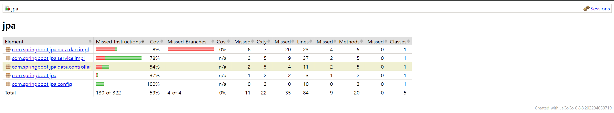

# 🌱 스프링부트 핵심가이드 프로젝트

> 스프링부트 핵심가이드 책에 나오는 코드를 직접쳐가며 스프링부트 사용법에 대해 알아보는 프로젝트입니다.


<br>

## 🛠️ Development Environment
- 🖥️ **Intellij IDEA Ultimate**
- ☕ **Java 17**
- ☕ **Jdk 17**
- 🔧 **Gradle 8.8**
- 🌱 **Spring Boot 3.3.2**

- ## 🧰 Tech Stack
- **Frameworks & Libraries**: Spring Boot, Spring Security, Spring Data JPA, Spring Web, Spring Configuration Processor
- **Databases**: H2, MariaDB
- **Utilities**: Lombok, Logback, Swagger, Jacoco

## 📖 API Documentation 
### [Swagger로 API 테스트](http://localhost:8080/swagger-ui/index.html)

|Swagger|
|------|


### 🔐 /product

<details>
<summary>상품 조회 API</summary>
  
- **GET** /product
  - 상품 번호로 상품을 조회합니다.
  - `number` 파라미터로 상품 번호를 받아 해당 상품 정보를 반환합니다.
  - 응답 예시:
    - 성공: 200 OK
      ```json
      {
          "number": 123,
          "name": "펜",
          "price": 1000,
          "stock": 1234
      }
      ```
    - 실패: 404 Not Found
      ```json
      {
          "error": "상품을 찾을 수 없습니다."
      }
      ```
</details>

<details>
<summary>상품 생성 API</summary>

- **POST** /product
  - 새로운 상품을 생성합니다.
  - `ProductDto` 형태의 JSON 데이터를 받아 새로운 상품을 생성합니다.
  - 응답 예시:
    - 성공: 200 OK
      ```json
      {
          "number": 123,
          "name": "펜",
          "price": 1000,
          "stock": 1234
      }
      ```
    - 실패: 400 Bad Request
      ```json
      {
          "error": "잘못된 요청입니다."
      }
      ```
</details>

<details>
<summary>상품 이름 변경 API</summary>

- **PUT** /product
  - 상품의 이름을 변경합니다.
  - `ChangeProductNameDto` 형태의 JSON 데이터를 받아 상품의 이름을 변경합니다.
  - 응답 예시:
    - 성공: 200 OK
      ```json
      {
          "number": 123,
          "name": "새로운 이름",
          "price": 1000,
          "stock": 1234
      }
      ```
    - 실패: 404 Not Found
      ```json
      {
          "error": "상품을 찾을 수 없습니다."
      }
      ```
</details>

<details>
<summary>상품 삭제 API</summary>

- **DELETE** /product
  - 상품 번호로 상품을 삭제합니다.
  - `number` 파라미터로 상품 번호를 받아 해당 상품을 삭제합니다.
  - 응답 예시:
    - 성공: 200 OK
      ```json
      {
          "message": "정상적으로 삭제되었습니다."
      }
      ```
    - 실패: 404 Not Found
      ```json
      {
          "error": "상품을 찾을 수 없습니다."
      }
      ```
</details>

## 🚦Jacoco 실행화면

| test | jacocoTestReport |
|------|------------------|
|  |  |
| jacocoTestCoverageVerification | 테스트 커버리지 |
|  |  |

